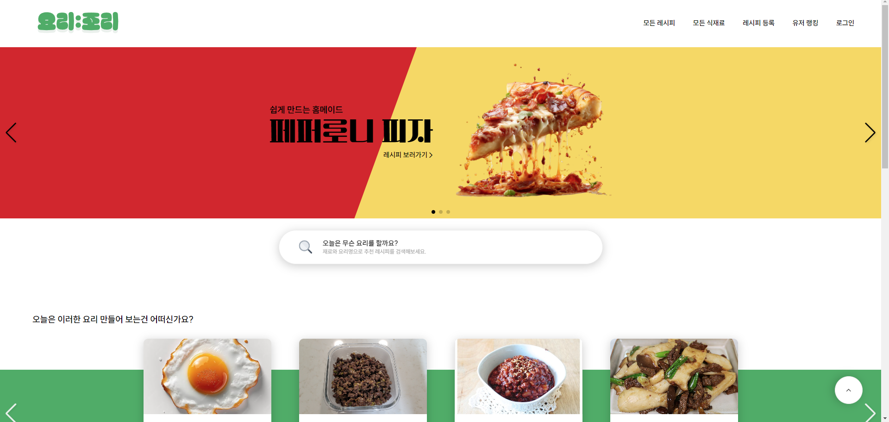

# 📜 시연 시나리오

---

1. 홈페이지 진입
    
    
    
2. 로그인 탭 누르기
    
    
    
3. 네이버 로그인 누르기
    
    
    
4. 네이버 로그인 진행하기
5. 로그인 완료 페이지 확인
    
    
    
6. 메인페이지에서 추천레시피 확인한번 해주기
    1. 추천레시피 탭 하나 정도 이동하여 레시피 잠깐 확인
    
    
    
7. 모든 레시피 탭 클릭
    
    아무거나 하나씩 좋아요도 누르고 스크랩도 누르기
    
    
    
8. 종류 → 밑반찬, 상황 → 초스피드, 재료 → 채소류, 방법 → 찜 눌러서 나온거 보여주기
    
    
    
9. 모든 식재료 탭누르기
    
    
    
    1. 실시간 물가 변동에서 아무거나 하나 누르기
    2. 그 다음 자세히 보기 누르기
    3. 월간, 주간, 일간 한번씩 누르기
        
        
        
    4. 옆에 최저가 구매 클릭 누르기
        
        
        
    5. 다시 돌아와서 자세히 보기 다시 눌러서 창 없애기
    6. 재료 검색창에 ‘도마도’라고 검색하기
    7. 검색 후 알고리즘으로 고쳐진 데이터 확인 후 토마토 좋아요 클릭
    8. 나온 물가동향의 월간, 주간, 일간, 최저가 데이터 확인
    9. 겨란 검색 후 계란 좋아요 클릭
    10. 좋아요한 목록에서 계란 클릭
        1. 월간, 주간, 일간, 최저가 한번씩 누르기
    11. 관련레시피에서 토마토계란볶음(가운데) 클릭
        1. 클릭한 레시피 한번 쭉 내리면서 보기
        2. 알레르기 확인 ,예상 칼로리 확인
        3. 리뷰 등록하기 누르기
            
            별 5개
            
            제목 : 따봉
            
            내용 : 따따봉
            
            사진 : 따봉사진
            
        4. 리뷰 달린거 확인하기
        5. 맨 아래 댓글달기
            
            내용 : 좋아용
            
        6. 댓글 확인하기
            
            
            
10. 레시피 등록탭으로 이동
    
    
    
    1. 레시피 데이터 넣어서 등록
        
        레시피명 : 소고기 볶음면
        
        요리소개 : 소고기 볶음면입니다
        
        카테고리 : 밑반찬, 소고기, 일상, 볶음
        
        인분 : 1인분
        
        난이도 : 쉬움
        
        시간 : 15분
        
        대표사진 : 소고기 볶음면 사진
        
        재료명 : 소고기
        
        수량 : 1
        
        단위 : 100g
        
        STEP1
        
        조리사진 : 고기 자르기
        
        조리설명 : 고기를 잘게 자릅니다
        
        STEP2
        
        조리사진 : 고기 볶기
        
        조리설명 : 고기를 볶습니다
        
        등록누르기
        
        
        
    2. 등록된 레시피 확인 → 모든레시피 눌러서 맨 아래에 >> 이거 눌러서 확인하기 또는 제목에 소고기 볶음면이라고 쳐서 확인하기
        
        
        
    3. 리뷰 등록하여 리뷰 확인
        
        제목 : 따봉
        
        내용 : 따따봉
        
        사진 : 따봉.png
        
11. 유저 랭킹탭 이동하여 랭킹 확인
    
    
    
12. 마이페이지에서 요리레벨과 등록한 레시피, 스크랩 레시피, 좋아요한 레시피 목록 확인
13. 나의 알러지 정보 수정탭에서 알러지 등록

→ 알레르기에 토마토 누른다음

→ 메인페이지로 이동하여서 토마토관련레시피 사라지는거 확인

